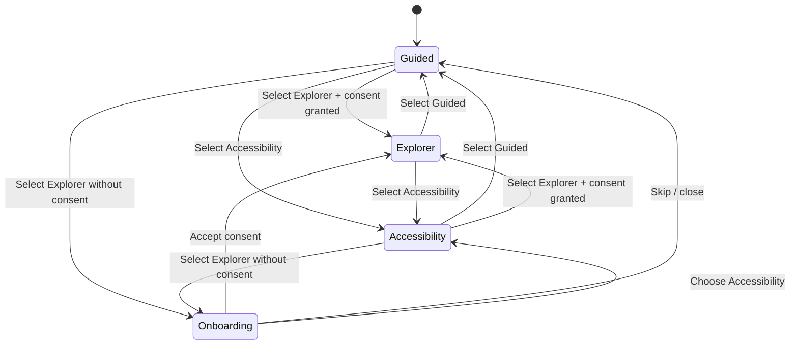

# Product Specification Index

This document is the implementation-facing product spec for Invisible Acropolis. It translates the current runtime architecture and IA contracts into a shared reference external engineers can use without relying on oral context.

## 1) Product goals and success metrics

### Product goals

1. Deliver an explorable 3D index that helps visitors discover destination pages quickly.
2. Keep visual navigation (3D labels) and textual navigation (UI overlay) synchronized from one source of truth.
3. Support multiple interaction comfort levels through explicit experience modes.
4. Preserve performance across a broad range of hardware while maintaining a high-quality default presentation.

### Success metrics

#### Discovery and navigation
- **Primary success metric**: users successfully open destination pages from either in-world links or navigation hub.
- **Secondary metrics**:
  - Visit depth per session (number of destination pages opened).
  - Time-to-first-navigation (from load to first destination click).
  - Share of sessions that use both UI and in-world navigation paths.

#### Engagement and control adoption
- Mode distribution across `guided`, `explorer`, and `accessibility`.
- Onboarding completion rate.
- Pointer-lock consent acceptance rate (Explorer mode readiness).

#### Reliability and quality
- Runtime load failures for `pages.json` should remain near zero.
- No uncaught fatal errors during world generation or navigation rendering.
- Stable frame-rate in default quality mode on target hardware tiers.

## 2) User personas and key journeys

### Persona A: First-time visitor (non-technical)
- **Goal**: understand what the experience is and get to a destination quickly.
- **Primary path**:
  1. Lands in Guided mode.
  2. Reads onboarding/help context.
  3. Uses navigation hub or nearby 3D label.
  4. Opens a destination page.

### Persona B: Technical explorer (power user)
- **Goal**: freely navigate scene and inspect multiple destinations.
- **Primary path**:
  1. Switches to Explorer mode.
  2. Grants pointer-lock consent.
  3. Uses FPS controls to move toward links.
  4. Opens multiple destination pages in one session.

### Persona C: Accessibility-sensitive visitor
- **Goal**: explore comfortably with reduced motion and no pointer lock.
- **Primary path**:
  1. Selects Accessibility mode.
  2. Navigates with keyboard turn support.
  3. Uses navigation hub and/or in-world links.
  4. Exits to selected destination without motion discomfort.

### Persona D: External implementation engineer
- **Goal**: add/update pages and interaction features safely.
- **Primary path**:
  1. Reviews `docs/INDEX_DATA.md`, this spec, and `docs/ARCHITECTURE.md`.
  2. Updates IA metadata source and regenerates `public/pages.json`.
  3. Verifies 3D links and navigation hub parity.
  4. Runs build + QA checklist before merging.

## 3) IA map and content model fields for `pages.json`

### IA map

Top-level navigation groups consumed by runtime:

- `Start here` (primary entry destinations)
- `Workflows` (task-oriented flows)
- `Reference` (documentation and technical references)
- `Labs` (experimental or advanced items)

### Content model (`public/pages.json`)

Each item must include:

- `title` (`string`): human-readable destination label.
- `url` (`string`): root-relative destination URL.
- `description` (`string`): short supporting summary.
- `category` (`string`): functional classification for grouping/scan.
- `navGroup` (`"Start here" | "Workflows" | "Reference" | "Labs"`): IA section.
- `priority` (`number`): ascending sort order used by both textual and 3D navigation.
- `statusBadge` (`string`): lifecycle marker (`Featured`, `Stable`, `Beta`, etc.).
- `iconToken` (`string`): compact icon/emoji.
- `audience` (`string`): intended user segment.

### IA governance rules

1. `index.html` is excluded from generated index entries.
2. Ordering is deterministic: `priority` then `url`.
3. Runtime consumers must treat this schema as a strict contract.
4. Any new field additions require coordinated updates to generator and consumers.

## 4) UI component inventory and ownership

| Area | Component / Module | Responsibility | Primary owner |
|---|---|---|---|
| Scene bootstrap | `src/index.ts` | Runtime orchestration, lifecycle, world regeneration triggers | Core runtime |
| IA loading | `src/data/pages.ts` | Fetch + schema validation for `pages.json` | Data contract |
| Text navigation | `src/ui/navigationHub.ts` | Grouped destination UI and fallback behavior | UI systems |
| 3D navigation | `src/scene/links.ts` | In-world label generation and interaction targets | Scene systems |
| Experience mode state | `src/ui/experienceState.ts` | Persisted mode machine + consent flags | Interaction systems |
| Mode controls | `src/ui/experienceControls.ts` | User-facing mode toggle and help entrypoint | UI systems |
| Onboarding | `src/ui/onboardingModal.ts` | First-run and consent UX | Interaction systems |
| FPS controls | `src/controls/fps.ts` | Guided/Explorer/Accessibility control implementations | Input systems |
| Quality controls | `src/effects/postprocessing.ts`, `src/ui/experienceControls.ts` | Rendering quality policy and user overrides | Rendering systems |
| Analytics events | `src/telemetry/*` | Interaction and quality observability emissions | Analytics |

> Ownership labels are functional and may map to one or more engineers depending on staffing.

## 5) Interaction state machine diagram

### State machine notes
- Pointer lock is only available in `Explorer` and only when consent is true.
- `Accessibility` mode explicitly disallows pointer lock and reduces motion.
- Mode and onboarding preferences are persisted for repeat sessions.

## 6) Accessibility requirements and acceptance criteria

### Requirements

1. Provide a non-pointer-lock navigation mode at all times.
2. Provide reduced-motion mode with lower movement/sway.
3. Ensure all critical controls are keyboard reachable.
4. Preserve readable text contrast and legibility in UI overlays.
5. Keep link activation discoverable regardless of active mode.

### Acceptance criteria

- **AC-A11Y-1**: User can switch to Accessibility mode without using pointer lock.
- **AC-A11Y-2**: In Accessibility mode, pointer lock is never requested.
- **AC-A11Y-3**: Keyboard-only user can navigate mode controls and open help/onboarding.
- **AC-A11Y-4**: Keyboard turn (`ArrowLeft` / `ArrowRight`) works in Accessibility mode.
- **AC-A11Y-5**: Navigation hub remains available as a non-spatial fallback path.
- **AC-A11Y-6**: Motion-sensitive user can complete a destination click-through in Accessibility mode.

## 7) Performance budgets and QA checklist

### Performance budgets (target)

- Initial render path should avoid long main-thread stalls during startup.
- Target smooth interaction at nominal quality presets on mainstream hardware tiers.
- World regeneration (terrain/props/links) should complete without blocking user input for prolonged periods.
- Navigation UI and `pages.json` parsing must remain lightweight relative to rendering workload.

### QA checklist (release gate)

#### IA and data
- [ ] `npm run generate:pages` completes successfully.
- [ ] `public/pages.json` contains expected entries and ordering.
- [ ] Navigation hub and 3D links reflect the same destination set.

#### Interaction modes
- [ ] Guided mode starts correctly for first-time run.
- [ ] Explorer mode requires consent before pointer lock.
- [ ] Accessibility mode disables pointer lock and enables keyboard turning.
- [ ] Onboarding `never show again` behavior persists across reloads.

#### Accessibility
- [ ] Mode controls are keyboard accessible.
- [ ] Help/onboarding can be reopened from controls.
- [ ] Destination can be reached using non-pointer-lock path.

#### Performance and rendering
- [ ] Build output succeeds (`npm run build`).
- [ ] No obvious frame collapse after mode switches and world regeneration.
- [ ] Quality settings can be changed without runtime errors.

#### Regression
- [ ] No uncaught console errors during initial load + first interaction cycle.
- [ ] Link click-through still opens expected destination URLs.

---

## Related docs

- `docs/OVERVIEW.md`
- `docs/DEV_GUIDE.md`
- `docs/ARCHITECTURE.md`
- `docs/INDEX_DATA.md`
- `docs/INTERACTIONS.md`
- `docs/INDEX_ANALYTICS.md`
