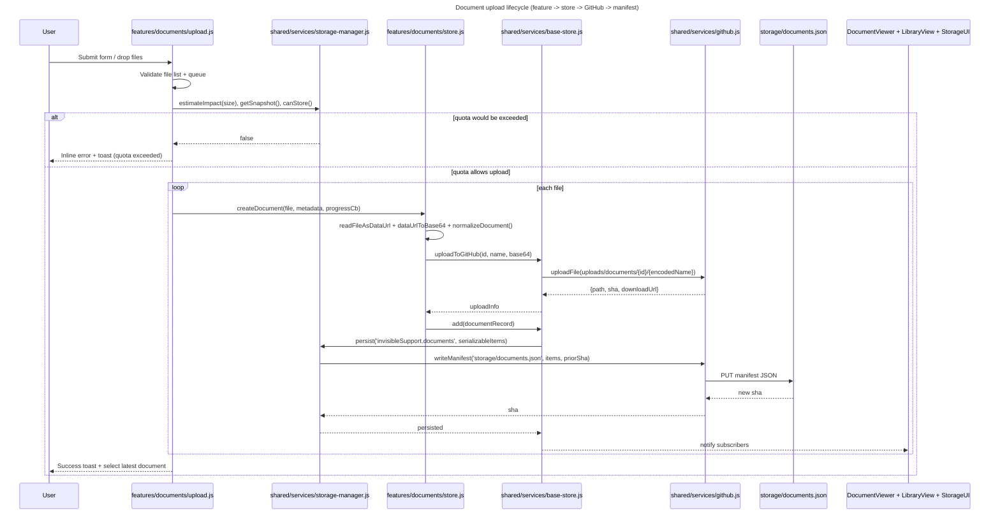
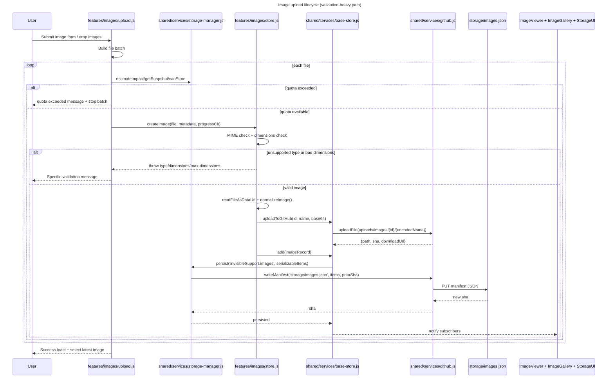
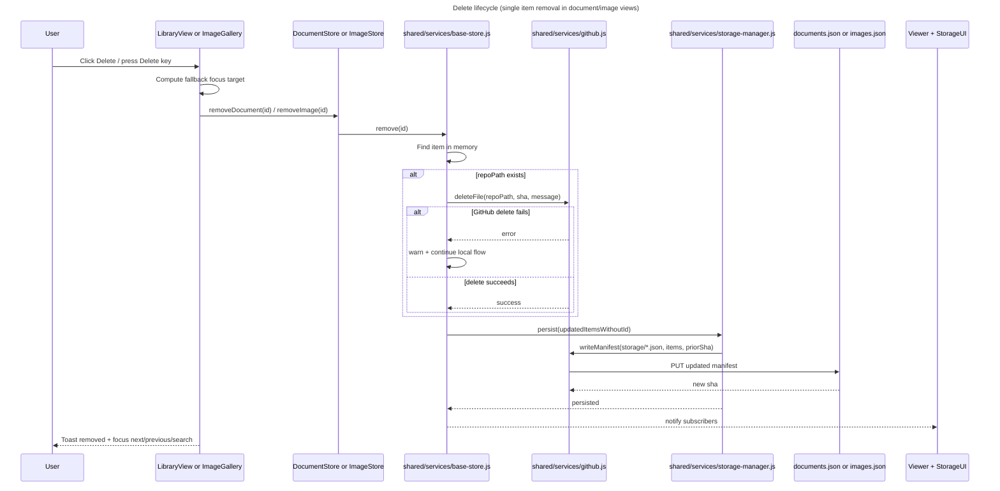
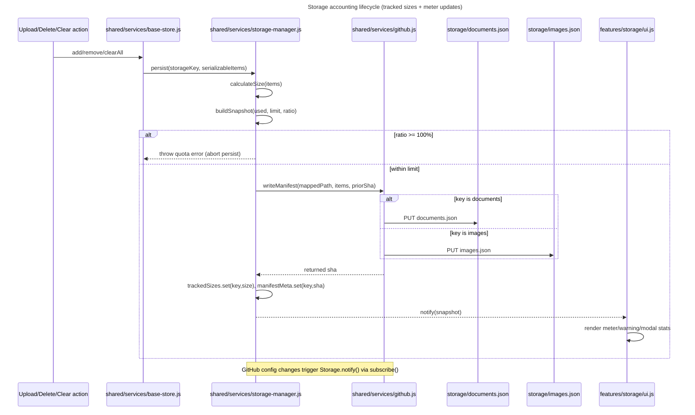
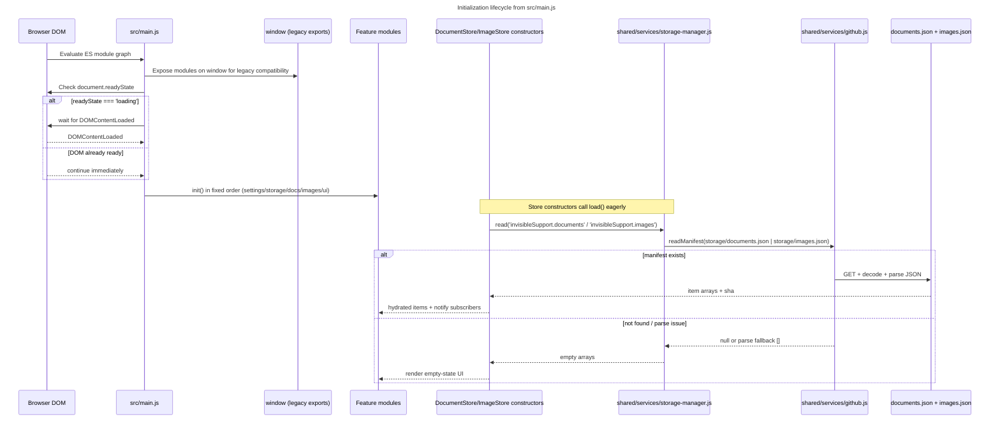

# Invisible Support data flow and persistence

This document traces how the Invisible Support portal moves data between UI features, in-memory stores, GitHub-backed file storage, and JSON manifests.

## Scope traced

- Feature modules under `public/InvisibleSupport/src/features/**`:
  - Documents: `upload.js`, `store.js`, `library-view.js`, `viewer.js`.
  - Images: `upload.js`, `store.js`, `gallery.js`, `viewer.js`.
  - Storage/settings: `storage/ui.js`, `settings/github-settings.js`.
- Shared services:
  - `public/InvisibleSupport/src/shared/services/github.js`
  - `public/InvisibleSupport/src/shared/services/storage-manager.js`
  - `public/InvisibleSupport/src/shared/services/base-store.js` (bridge used by both document/image stores)
- Manifests:
  - `public/InvisibleSupport/storage/documents.json`
  - `public/InvisibleSupport/storage/images.json`

---

## 1) Document upload lifecycle

### Failure branch (user-visible fallback)

- If no files are selected, upload is blocked and the user sees inline + toast feedback.
- If configuration is missing (GitHub owner/repo/token), the upload returns a configuration error and shows a “missing configuration” message.
- If manifest persistence fails after file upload, the UI shows a generic persistence failure error and keeps the progress UI from finishing as success.

---

## 2) Image upload lifecycle

### Failure branch (user-visible fallback)

- Invalid type, unreadable image, or oversize dimensions return explicit validation messages (not just a generic error).
- If quota is exhausted, the flow exits early and shows storage quota feedback.
- If remote upload/manifest write fails, the user receives persistence failure messaging and no success toast is emitted.

---

## 3) Delete lifecycle for docs/images

### Failure branch (user-visible fallback)

- If remote file deletion fails, removal still continues locally by updating the manifest with the item removed; the user can still see it disappear from UI.
- If the manifest persistence step fails, the list action catches and shows a persistence error toast.
- Keyboard/mouse delete maintains accessibility fallback by shifting focus to neighbor row/item or search input.

---

## 4) Storage accounting lifecycle

### Failure branch (user-visible fallback)

- Quota breach is blocked before manifest write; upload forms show quota exceeded feedback.
- Non-config read errors in `StorageManager.read()` degrade to `null`/empty state and reset tracked size to zero, preventing stale over-reporting.
- Storage UI always renders using the latest snapshot and shows warning/exceeded banners as visible guardrails.

---

## 5) Initialization lifecycle from `main.js`

### Failure branch (user-visible fallback)

- If GitHub is not configured, initial reads throw config errors that are caught by stores, resulting in empty lists instead of app crash.
- If manifests are missing, empty arrays are returned and UI renders empty states (library/gallery/storage counts).
- If manifest JSON is malformed, parse failure falls back to empty array, with app initialization continuing.

---

## Manifest shape notes for engineers

- `storage/documents.json` contains array records with fields such as `id`, `name`, `title`, `type`, `size`, `updatedAt`, `repoPath`, `sha`, `downloadUrl`.
- `storage/images.json` contains array records with fields such as `id`, `name`, `title`, `alt`, `type`, `size`, `width`, `height`, `updatedAt`, `capturedAt`, `exif`, `repoPath`, `sha`, `downloadUrl`.
- Storage accounting currently sums `size` from both arrays; this directly drives quota and warning behavior in the storage meter/modal.
