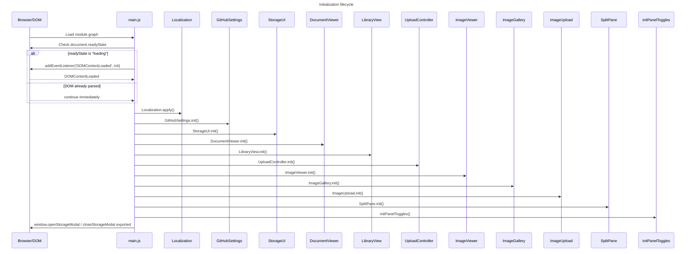

# Data flow and persistence

## Home page lifecycle
1. `main.js` evaluates module imports (shared infrastructure → services → feature slices → shared UI).
2. DOM readiness guard determines whether to run `init()` immediately or defer to `DOMContentLoaded`.
3. `init()` runs the ordered bootstrap chain (`Localization` through panel toggles).
4. Feature stores and views load persisted manifests/config and render current state.
5. User actions dispatch updates to stores/services.
6. GitHub/storage services persist changes and trigger UI refresh.

## Initialization lifecycle

## Panel toggle state flow

- `initPanelToggles()` queries all `[data-panel-toggle]` controls.
- Each click handler finds the nearest `.u-card`.
- If no card is found, the handler returns (no-op guard).
- Otherwise the handler toggles `.is-collapsed`, producing selector state `.u-card.is-collapsed`.
- The same event updates control text (`Expand`/`Collapse`) and `aria-label` (`Expand panel`/`Collapse panel`).

## Persistence surfaces
- GitHub configuration and local settings.
- Document/image manifests.
- Split-pane/collapse layout preferences.

## Engineer notes
- Trace issue paths using the panel docs + shared systems docs together.
- Startup bugs are usually one of: wrong init order, DOM-not-ready assumptions, or missing global compatibility exports.
- Confirm deletion and upload paths both update manifest + storage indicators.
